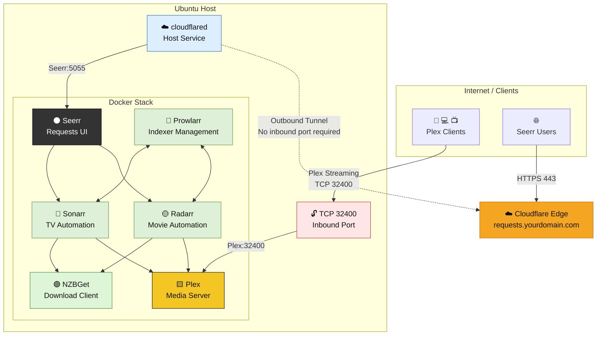

```mermaid
flowchart TB

    %% =========================================================
    %% INTERNET / CLIENTS
    %% =========================================================

    subgraph Internet["Internet / Clients"]
        PlexClients["📱 💻 📺<br/>Plex Clients"]
        SeerrUsers["🌐<br/>Seerr Users"]
    end

    Cloudflare["☁️ Cloudflare Edge<br/>requests.yourdomain.com"]

    SeerrUsers -->|"HTTPS 443"| Cloudflare


    %% =========================================================
    %% UBUNTU HOST
    %% =========================================================

    subgraph Host["Ubuntu Host"]

        PlexPort["🔓 TCP 32400<br/>Inbound Port"]

        Cloudflared["☁️ cloudflared<br/>Host Service"]

        subgraph Docker["Docker Stack"]
            direction TB
            
            Plex["🟨 Plex<br/>Media Server"]
            Seerr["⚫ Seerr<br/>Requests UI"]
            Sonarr["🔵 Sonarr<br/>TV Automation"]
            Radarr["🟡 Radarr<br/>Movie Automation"]
            Prowlarr["🔷 Prowlarr<br/>Indexer Management"]
            NZBGet["🟢 NZBGet<br/>Download Client"]

            %% API FLOWS
            Seerr --> Sonarr
            Seerr --> Radarr

            Sonarr --> NZBGet
            Sonarr --> Plex

            Radarr --> NZBGet
            Radarr --> Plex

            Prowlarr <--> Sonarr
            Prowlarr <--> Radarr
        end

        PlexPort -->|"Plex:32400"| Plex

        Cloudflared -->|"Seerr:5055"| Seerr
    end


    %% =========================================================
    %% EXTERNAL NETWORK FLOWS
    %% =========================================================

    PlexClients -->|"Plex Streaming<br/>TCP 32400"| PlexPort

    Cloudflared -.->|"Outbound Tunnel<br/>No inbound port required"| Cloudflare


    %% =========================================================
    %% STYLING
    %% =========================================================

    classDef plex fill:#f3c623,stroke:#222,color:#111;
    classDef seerr fill:#333,stroke:#111,color:#fff;
    classDef arr fill:#dff0d8,stroke:#609b50,color:#111;
    classDef nzb fill:#dff5d8,stroke:#45933f,color:#111;
    classDef cloud fill:#f4a623,stroke:#cc7600,color:#111;
    classDef tunnel fill:#dceeff,stroke:#3478bd,color:#111;
    classDef port fill:#ffe6e6,stroke:#bb4444,color:#111;

    class Plex plex;
    class Seerr seerr;
    class Sonarr,Radarr,Prowlarr arr;
    class NZBGet nzb;
    class Cloudflare cloud;
    class Cloudflared tunnel;
    class PlexPort port;
```
